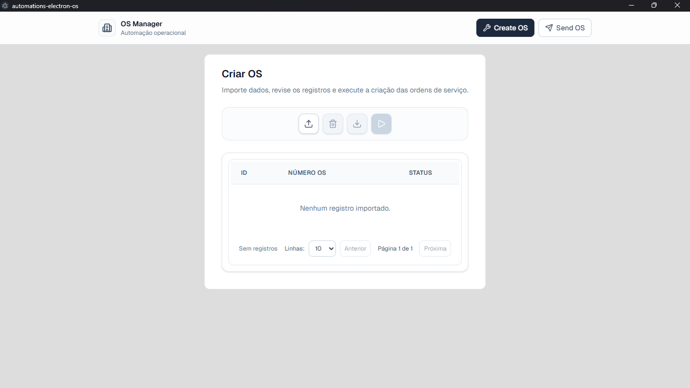
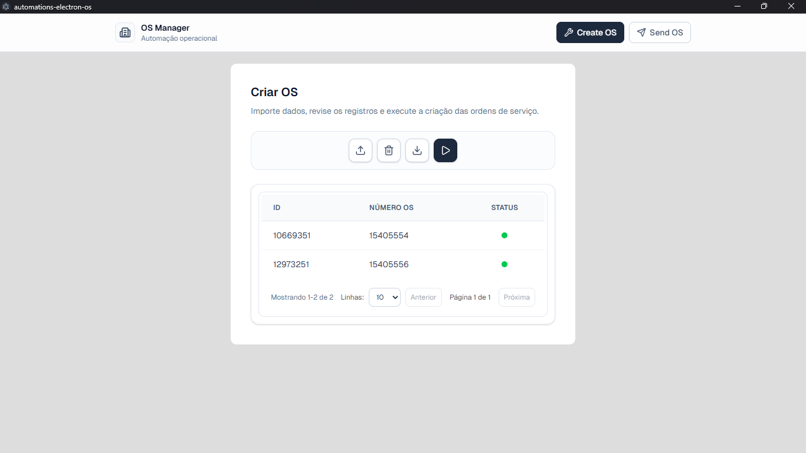
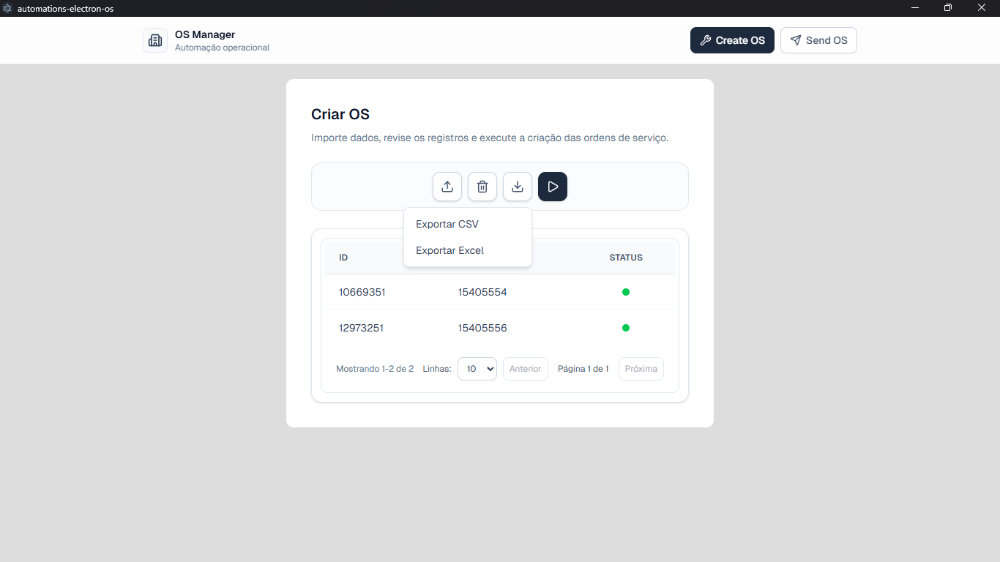

# OS Manager

OS Manager é uma aplicação desktop desenvolvida com Electron e React para automatizar a criação e envio de Ordens de Serviço (OS) no sistema SMGI Max, utilizado pela prefeitura de São Paulo. O sistema visa substituir processos manuais repetitivos, oferecendo maior eficiência e reduzindo erros humanos.

## Como Funciona

O OS Manager simplifica drasticamente o processo de criação de ordens de serviço:

1. **Importe seus dados**: Selecione um arquivo Excel ou CSV contendo a lista de ativos
2. **Clique em iniciar**: A automação começa a processar as ordens
3. **Acompanhe em tempo real**: Cada OS mostra seu status na tabela (Pendente → Em Andamento → Concluído)
4. **Veja os números**: Assim que cada OS é criada no SMGI Max, seu número aparece automaticamente
5. **Exporte os resultados**: Baixe os dados finalizados em Excel ou CSV

Tudo isso sem necessidade de intervenção manual, eliminando riscos de erros e duplicatas!

## Funcionalidades Principais

- **Criação Automática de OS**: Importe dados de ativos via Excel/CSV e crie ordens de serviço automaticamente no SMGI Max com feedback em tempo real.
- **Acompanhamento Visual**: Veja o status de cada OS (Pendente → Em Andamento → Concluído) diretamente na interface.
- **Número da OS Instantâneo**: Após a criação, o número gerado aparece imediatamente na tabela.
- **Exportação de Resultados**: Baixe os resultados em Excel ou CSV com todos os dados e números de OS gerados.
- **Envio de OS**: (Em desenvolvimento) Automatize o planejamento, designação de equipes e aprovação de ordens de serviço.
- **Interface Intuitiva**: Interface React moderna com tabelas paginadas, validação de dados e acompanhamento em tempo real.
- **Automação Robusta**: Utiliza Playwright para interação com o navegador, garantindo compatibilidade com o sistema web.

## Arquitetura do Sistema

O sistema é dividido em três camadas principais: Front-end, Electron (back-end), e uma API sugerida para futuras implementações.

### Front-end (React + Vite)

O front-end é construído com React 19 e Vite, oferecendo uma interface moderna e responsiva.

- **Tecnologias**: React 19, React Router DOM, Zustand (gerenciamento de estado), Tailwind CSS, shadcn-ui.
- **Páginas**:
  - `createOs.tsx`: Página para criação de ordens de serviço.
  - `sendOs.tsx`: Página para envio de ordens (em desenvolvimento).
- **Componentes**:
  - `header.tsx`: Navegação entre páginas.
  - `table.tsx`: Exibição de ordens com paginação e indicadores de status.
  - `importFile.tsx`: Diálogo para importação de arquivos Excel/CSV.
- **Gerenciamento de Estado**: Utiliza Zustand para armazenar listas de ordens e status de execução.
- **Validação**: Dados são validados antes do processamento, garantindo integridade.

### Electron (Main Process e Automations)

O Electron gerencia o processo principal e as automações via Playwright.

- **Main Process** (`electron/main.js`): Coordena a comunicação entre front-end e automações via IPC.
- **Preload Script** (`electron/preload.cjs`): Expõe APIs seguras para o renderer process.
- **Automations**:
  - `createOsRunner.js`: Orquestra a criação de OS, gerenciando fila e retries.
  - `createOsClient.js`: Automação Playwright para interagir com o SMGI Max e criar OS.
  - `sendOsClient.js`: Automação para envio de OS (parcialmente implementada).
- **Comunicação**: Eventos são transmitidos em tempo real do back-end para o front-end via IPC.

### API Sugerida

Para substituir a automação baseada em navegador (que é lenta devido a waits), sugere-se implementar uma API REST que replique as funcionalidades do SMGI Max. Isso permitiria processamento paralelo e maior velocidade.

#### Endpoints Sugeridos

- **POST /auth/login**: Autenticação no SMGI Max.
  - Body: `{ "username": "string", "password": "string" }`
  - Response: `{ "token": "string" }`

- **POST /os/create**: Criar uma ordem de serviço.
  - Headers: `Authorization: Bearer <token>`
  - Body: `{ "ativo": "string", "classificacao": "string", "detalhes": "string" }`
  - Response: `{ "osNumber": "string" }`

- **POST /os/send**: Enviar/planejar uma ordem de serviço.
  - Headers: `Authorization: Bearer <token>`
  - Body: `{ "osNumber": "string", "equipe": "string", "encarregado": "string", "veiculo": "string" }`
  - Response: `{ "status": "success" }`

- **GET /os/status/:osNumber**: Verificar status de uma OS.
  - Headers: `Authorization: Bearer <token>`
  - Response: `{ "status": "string", "details": "object" }`

#### Considerações de Segurança
- Use HTTPS para todas as requisições.
- Implemente rate limiting para evitar sobrecarga no servidor SMGI.
- Armazene tokens de forma segura (não em localStorage).

## Benchmark e Performance

### Comparação com Processo Manual
- **Automação**: Capacidade de criar até 360 ordens de serviço por hora.
- **Humano**: 60 a 120 ordens por hora.
- **Eficiência**: A automação é 3 a 6 vezes mais rápida, além de eliminar erros como números incorretos ou ordens duplicadas por falta de atenção.

### Otimizações Futuras
A velocidade atual não representa uma limitação do sistema, pois grande parte do tempo é gasto aguardando o carregamento do site após cliques ou preenchimentos. Para otimizar:
- **Múltiplas Abas**: Se o site permitir, abrir múltiplas abas para processamento paralelo.
- **Múltiplos Contextos**: Melhor estratégia: usar múltiplos contextos do navegador para acessar o site em paralelo, multiplicando a velocidade com cada novo contexto.

## Instalação e Uso

### Pré-requisitos
- Node.js 18+
- npm ou yarn
- Conta válida no SMGI Max

### Instalação
1. Clone o repositório:
   ```bash
   git clone <url-do-repo>
   cd automations-electron-os
   ```

2. Instale as dependências:
   ```bash
   npm install
   ```

3. Configure as variáveis de ambiente (veja seção Configuração).

4. Execute o aplicativo:
   ```bash
   npm run dev
   ```

### Guia de Uso - Criação de Ordens de Serviço

O processo de criação de ordens de serviço é simples e intuitivo. Veja abaixo o passo a passo com imagens e vídeo:

#### Passo 1: Iniciar a Aplicação
Ao abrir a aplicação, você será recebido pela interface limpa e intuitiva da página "Criar OS".



#### Passo 2: Importar Arquivo com Ativos
Clique no botão de importação e selecione um arquivo Excel (.xlsx) ou CSV (.csv) contendo a lista de ativos. O arquivo deve incluir uma coluna `ativo` com os IDs dos ativos.


#### Passo 3: Iniciar a Automação
Após importar o arquivo, clique em "Iniciar" para começar a criação automática das ordens de serviço. O sistema processará cada ativo sequencialmente, criando as OS no SMGI Max.

#### Passo 4: Acompanhar o Progresso
Em tempo real, você verá o status de cada ordem na tabela:
- **Pendente**: Aguardando processamento
- **Em Andamento**: Sendo criada no SMGI Max
- **Concluído**: OS criada com sucesso (número da OS exibido)



#### Passo 5: Exportar Resultados
Após a conclusão, você pode exportar os resultados em Excel ou CSV com os números das OS geradas.



#### Vídeo Demonstrativo
Veja abaixo um vídeo completo do processo em ação:

[](./Criação%20de%20ordem%20de%20serviço.mp4)

*Clique para assistir ao vídeo completo do processo*

### Recursos Principais do Processo
- ✅ **Importação Flexível**: Suporta Excel (.xlsx) e CSV (.csv)
- ✅ **Validação Automática**: Dados validados antes do processamento
- ✅ **Feedback em Tempo Real**: Status atualizado a cada OS criada
- ✅ **Número da OS Imediato**: Número gerado aparece assim que a OS é criada
- ✅ **Exportação Fácil**: Baixe os resultados em Excel ou CSV
- ✅ **Sem Erros Manuais**: Elimina riscos de números incorretos ou duplicados

## Configuração

Crie um arquivo `.env` na raiz do projeto com as seguintes variáveis:

```env
SMGI_USERNAME=seu_usuario
SMGI_PASSWORD=sua_senha
SMGI_CLASSIFICACAO=1287  # Classificação padrão
SMGI_DETALHES=Manutenção  # Detalhes padrão
SMGI_HEADLESS=false  # Mostrar navegador (true para headless)
SMGI_BASE_URL=https://smgi.max.prefeitura.sp.gov.br  # URL do SMGI
```

**Atenção**: Nunca commite credenciais no repositório. Use `.gitignore` para ignorar `.env`.

## Economia de Tempo e Redução de Erros

### Comparação de Desempenho
O OS Manager oferece uma melhoria significativa em relação ao processo manual:

| Aspecto | Manual | Automação | Ganho |
|---------|--------|-----------|-------|
| **Velocidade** | 60-120 OS/hora | 360 OS/hora | **3-6x mais rápido** |
| **Tempo para 1.000 OS** | 8-17 horas | ~2,8 horas | **14 horas economizadas** |
| **Erros de digitação** | Comum | Zero | **100% redução** |
| **Ordens duplicadas** | Frequente | Impossível | **Prevenção total** |
| **Custo humano/1.000 OS** | ~500-1.000 horas | ~2,8 horas | **Redução de 99%** |

### Benefícios Práticos
- **Elimina erros humanos**: Sem risco de números incorretos ou duplicação de ordens
- **Libera recursos**: Equipe pode focar em tarefas de maior valor agregado
- **Escalabilidade**: Processe qualquer volume de ordens sem esforço adicional
- **Consistência**: Cada OS é criada exatamente da mesma forma

## Desenvolvimento

### Tecnologias
- **Front-end**: React 19, TypeScript, Vite
- **Back-end**: Electron, Node.js, Playwright
- **Outros**: Zustand, Tailwind CSS, shadcn-ui, XLSX

### Build
```bash
npm run build
```

### Contribuição
1. Fork o projeto.
2. Crie uma branch para sua feature.
3. Faça commit das mudanças.
4. Abra um Pull Request.

Para dúvidas ou sugestões, abra uma issue no repositório.